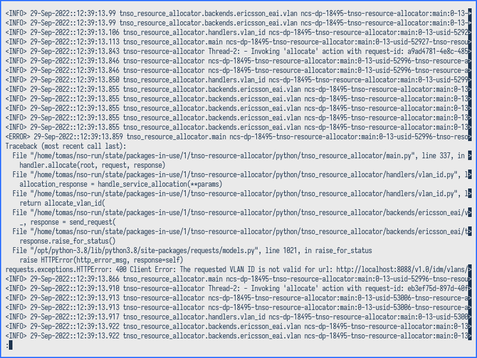
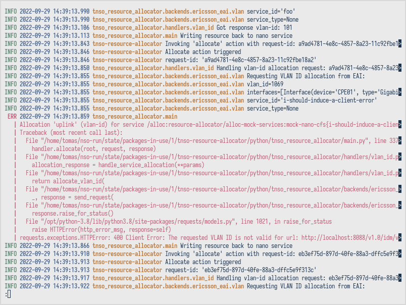

# NSO log reader

Read NSO logs with ease and comfort.

This nifty tool parses logs from Cisco NSO and displays them in a manner much
more fit for humans.

Stand-out readability features:

- Log fields are properly aligned into columns
- Each column is colorized
- Multi-line messages are grouped and indented
- Thread names are removed, as they are almost never useful
- Dates are formatted in a non-crazy way
- The date column is removed when in follow-mode
- Times are converted to local time rather than UTC

All this is to reduce clutter and make the actual information easier to pick
out.

The results speak for themselves:




As a bonus, the reader is written in Rust, allowing it to be blazing fast and
trivially easy to deploy (just copy a binary).

## Usage

The log reader can be called in a few different ways. You can pass the option
`-l` followed by a path to a log file. However, by default it expects one or
more tokens that it will use to substring match the log files. These calls are
equivalent:

    $ nso-log-reader -l /my/nso/log/dir/ncs-python-vm-my-awesome-package.log
    $ nso-log-reader awesome

As long as the substring "awesome" only matches one log file in the log
directory, that log file will be selected.

By default, log files will be parsed and piped to `less` for paging. However,
when developing, it's more useful to continuously tail a log file. For that,
pass the `-f` option.

**NB:** The log reader is only tested with Python logs (i.e.
"ncs-python-vm-\*") and might not work with other log files, depending on their
formatting.

## TODO

- [ ] Bug: Multi-line log messages are not output if they are the last message
  in the stream, since the parser is still waiting for more lines. Solve this
  by adding a very short timer. All log messages are written to the log output
  in one go, i.e. a single log message cannot be streamed, so any delay means
  that the log message is done.

- [x] Format the time as local time rather than UTC

- [ ] Any time a log message is printed, check how long has passed since the
  previous log message. If it's longer than X seconds, first print a separator
  that looks something like this:

  ```
  --- 15 seconds later --------------------------------------------------------
  ```

  Perhaps make it cover the full terminal width?

- [ ] Allow filtering by severity, that way the user can keep debug logging
  enabled but only have to see them when needed.
